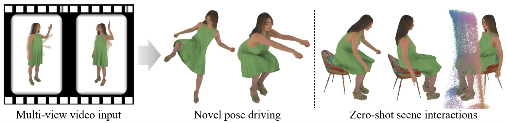
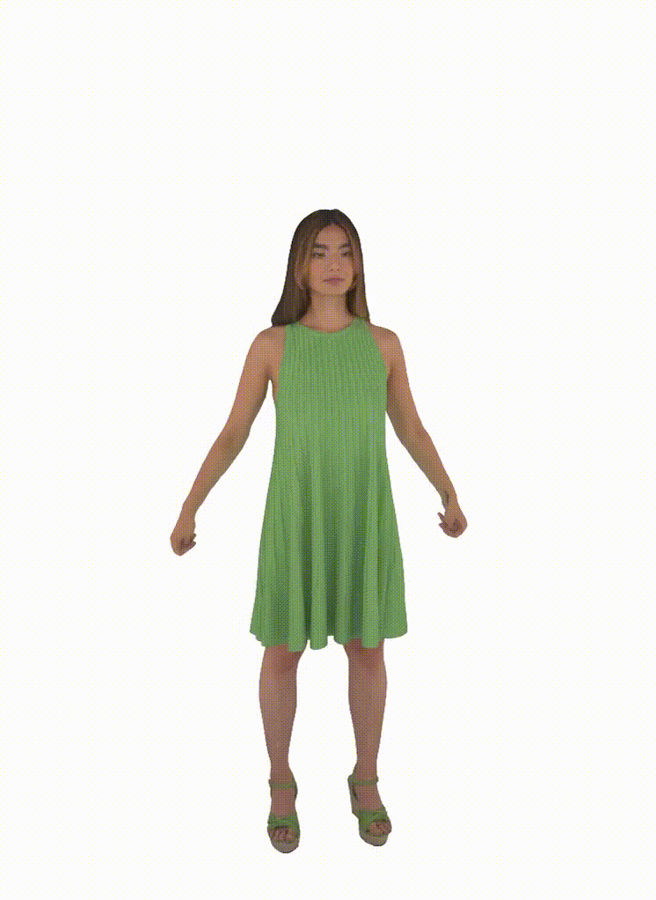

# MPMAvatar

## MPMAvatar: Learning 3D Gaussian Avatars with Accurate and Robust Physics-Based Dynamics (NeurIPS 2025) ##

[Changmin Lee](https://github.com/KAISTChangmin/), [Jihyun Lee](https://jyunlee.github.io/), [Tae-Kyun (T-K) Kim](https://sites.google.com/view/tkkim/home)

KAIST
 
**[\[Project Page\]](https://kaistchangmin.github.io/MPMAvatar/) [\[Paper\]](https://arxiv.org/pdf/2510.01619.pdf) [\[Supplementary Video\]](https://youtu.be/ytrKDNqACqM)**

<p align="center">
  
</p>

<p align="center">
  
  
</p>

> we present **MPMAvatar**, a framework for creating 3D human avatars from multi-view videos that supports highly realistic, robust animation, as well as photorealistic rendering from free viewpoints. For accurate and robust dynamics modeling, our key idea is to use a Material Point Method-based simulator, which we carefully tailor to model garments with complex deformations and contact with the underlying body by incorporating an anisotropic constitutive model and a novel collision handling algorithm. We combine this dynamics modeling scheme with our canonical avatar that can be rendered using 3D Gaussian Splatting with quasi-shadowing, enabling high-fidelity rendering for physically realistic animations. In our experiments, we demonstrate that MPMAvatar significantly outperforms the existing state-of-the-art physics-based avatar in terms of (1) dynamics modeling accuracy, (2) rendering accuracy, and (3) robustness and efficiency. Additionally, we present a novel application in which our avatar generalizes to unseen interactions in a zero-shot manner—which was not achievable with previous learning-based methods due to their limited simulation generalizability.

&nbsp;

## Environment Setup  

1. Clone this repository

<pre><code> $ git clone https://github.com/KAISTChangmin/MPMAvatar.git
 $ cd MPMAvatar </pre></code>

2. Install required apt packages

<pre><code> $ sudo apt-get update
 $ sudo apt-get install ffmpeg gdebi libgl1-mesa-glx libopencv-dev libsm6 libxrender1 libfontconfig1 libglvnd0 libegl1 libgles2 </pre></code>
 
3. Install [Blender](https://www.blender.org/) for Ambient Occlusion map baking

<pre><code> $ curl -OL https://download.blender.org/release/Blender4.4/blender-4.4.1-linux-x64.tar.xz
 $ tar -xJf ./blender-4.4.1-linux-x64.tar.xz -C ./
 $ rm -f ./blender-4.4.1-linux-x64.tar.xz
 $ mv ./blender-4.4.1-linux-x64 /usr/local/blender
 $ export PATH=/usr/local/blender:$PATH </pre></code>

3. Create conda environment and install required pip packages

<pre><code> $ conda create -n mpmavatar python=3.10
 $ conda activate mpmavatar
 $ pip install torch==2.0.0+cu118 torchvision==0.15.1+cu118 -f https://download.pytorch.org/whl/torch_stable.html
 $ pip install -r ./requirements.txt
 $ pip install git+https://gitlab.inria.fr/bkerbl/simple-knn.git
 $ pip install git+https://github.com/slothfulxtx/diff-gaussian-rasterization.git
 $ FORCE_CUDA=1 pip install git+https://github.com/facebookresearch/pytorch3d.git </pre></code>

&nbsp;

## Data Preparation 

### ActorsHQ data
Download [ActorsHQ](https://actors-hq.com/) data by filling their request form in this [link](https://drive.google.com/file/d/1QpZIhsUIWLAgQCXWXdj865gSNkjpCRrd/view). We used four sequences: `Actor01-Sequence1`, `Actor02-Sequence1`, `Actor03-Sequence1`, `Actor06-Sequence1`, following the [PhysAvatar](https://qingqing-zhao.github.io/PhysAvatar)'s setting.

### 4D-DRESS data
Download [4D-DRESS](https://eth-ait.github.io/4d-dress/) data by filling their request form in this [link](https://4d-dress.ait.ethz.ch/). We used four sequences: `00170_Inner`, `00185_Inner`, `00190_Inner`, `00191_Inner`

### PhysAvatar data
Download the preprocessed data (e.g. SMPL-X parameters, template meshes, garment part segmentation, uv coordinates) for ActorsHQ dataset by PhysAvatar using their [drive link](https://drive.google.com/drive/folders/1Fl_WqNXAnZbAOHJwbcav5FYvFSLbh6OQ) and unpack it in `./data` folder.

### Additional preprocessed data
Download the additional preprocessed data for ActorsHQ and 4D-DRESS dataset using this [drive link](https://drive.google.com/drive/folders/1kP4mUgUA7rP4wGekMs-jQkg7ETSndQ7O) and unpack it in `./data` folder.

### SMPL-X models
Download SMPL-X model and [VPoser](https://github.com/nghorbani/human_body_prior) checkpoint from [its official website](https://smpl-x.is.tue.mpg.de/). You need to download **SMPL-X v1.1 (NPZ+PKL, 830 MB)** and **VPoser v1.0 - CVPR'19 (2.5MB)**. Unzip the downloaded files and move each body models and VPoser checkpoint (`vposer_v1_0/snapshots/TR00_E096.pt`) to `./data/body_models`.

In the end your `./data` folder should look like this:
```
data
    |-- ActorsHQ
        |-- Actor01
        |-- Actor02
        |-- Actor03
        |-- Actor06
    |-- 4D-DRESS
        |-- 00170_Inner
        |-- 00185_Inner
        |-- 00190_Inner
        |-- 00191_Inner
    |-- body_models
        |-- smplx
            |-- SMPLX_NEUTRAL.pkl
            |-- SMPLX_FEMALE.pkl
            |-- SMPLX_MALE.pkl
        |-- TR00_E096.pt
    |-- a1_s1
    |-- a2_s1
    |-- a3_s1
    |-- a6_s1
    |-- s170_t1
    |-- s185_t1
    |-- s190_t2
    |-- s191_t2
    |-- demo
```

&nbsp;
   
## Preprocessing

<pre><code> $ cd preprocess
 $ bash ./scripts/actorshq_a1.sh
 $ cd .. </pre></code>

## Training

<pre><code> $ bash ./scripts/appearance/actorshq_a1.sh
 $ bash ./scripts/physics/actorshq_a1.sh </pre></code>

## Simulation & Rendering

<pre><code> $ bash ./scripts/sim/actorshq_a1.sh </pre></code>

## Evaluation

<pre><code> $ bash ./scripts/eval/actorshq_a1.sh </pre></code>

## Run Demo

<pre><code> $ python run_demo.py --save_name chair_sand --output_dir ./output/demo </pre></code>
